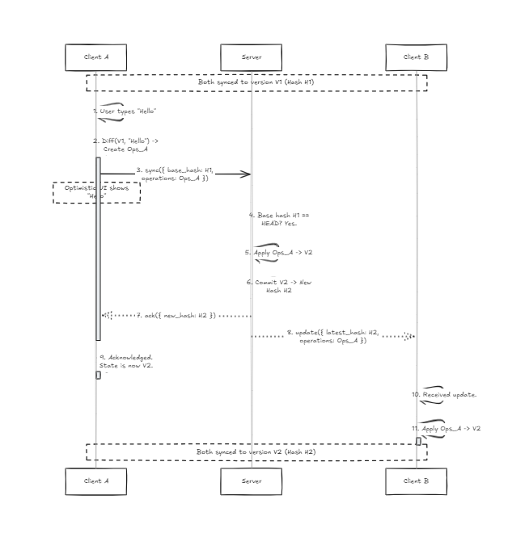

# Collaborative Notepad (OT Implementation)

This project is a real-time collaborative text editor built from scratch using Bun, TypeScript, and WebSockets. It serves as a practical demonstration of **Operational Transformation (OT)** for achieving conflict-free, multi-user text synchronization.

The server maintains a version history for each document, inspired by Git's commit model, to manage different states and enable robust transformations.

## Features

- **Real-time, Multi-User Editing**: Changes from one user are instantly broadcast to all other connected clients.
- **Operational Transformation (OT)**: A custom OT implementation resolves concurrent edits without data loss.
- **Optimistic UI Updates**: The editor updates immediately on user input, with client-side logic to rebase local changes against incoming server updates.
- **Git-like Document Versioning**: The server stores document states as a chain of hashed commits, providing a clear history.
- **Live Presence**: Shows a live count of users currently editing a document.
- **Modern Tech Stack**: Built with Bun's fast, all-in-one toolkit.

## Tech Stack

- **Runtime**: [Bun](https://bun.sh)
- **Language**: TypeScript
- **Backend**: Bun's native HTTP & WebSocket server
- **Frontend**: Plain HTML, TypeScript, and [Tailwind CSS](https://tailwindcss.com/) (via CDN)
- **Synchronization**: WebSockets with a custom Operational Transformation protocol.

## Getting Started

### Prerequisites

- You must have [Bun](https://bun.sh/docs/installation) installed on your machine.

### Installation

Clone the repository and install the dependencies:

```bash
git clone github.com/bethel-nz/ink
cd crdt
bun install
```

### Running the Application

The application consists of a backend sync server and a frontend client. You need to run them in two separate terminal sessions.

**1. Start the Sync Server**

This server handles WebSocket connections, applies operational transforms, and persists document versions.

```bash
bun run server/index.ts
```

The server will start on `http://localhost:3000`.

**2. Start the Frontend Client**

This command uses Bun's built-in development server to serve the client-side application.

```bash
bun run client/index.html
```

The client will be available at `http://localhost:3001` (or the next available port shown in your terminal).

**3. Collaborate!**

Open the client URL in multiple browser tabs or windows to simulate different users. Type in one editor, and you will see the changes reflected in the others in real-time.

---

## How It Works: A Deep Dive

This system works by transmitting compact "operations" describing user edits, rather than sending the full document text on every change. Here's a step-by-step breakdown of the data flow and logic.

### 1. Capturing Changes: The Diffing Algorithm (`server/versioning.ts`)

When a user makes an edit, we first need to determine exactly what changed. This is done with a character-by-character diffing algorithm.

- **Core Logic**: The `diff` function in `server/versioning.ts` uses a classic dynamic programming approach to find the **Longest Common Subsequence (LCS)** between the original text and the new text.
- **Output**: The result is an array of `DiffResult` objects, which is a flat list describing every character as either `added`, `removed`, or `unchanged`. For example, changing "cat" to "cart" yields:
  ```
  [
    { type: 'unchanged', char: 'c' },
    { type: 'unchanged', char: 'a' },
    { type: 'insert', char: 'r' }, // The change
    { type: 'unchanged', char: 't' }
  ]
  ```
  This character-level granularity is essential for the OT algorithm to work correctly on any kind of text change, including multi-line edits which are simply treated as a continuous stream of characters (including `\n`).

### 2. From Diffs to Actions: Operational Transformation (`common/ot.ts`)

The raw diff is not what we send over the network. We convert it into a more compact and intelligent format called an **Operation**.

- **The `Operation` Interface**: This is the universal language for changes in our system. An operation is an object like `{ type, position, text?, length? }`.
  - `type`: Can be `insert`, `delete`, or `retain`.
  - `position`: The character index in the document where the operation should apply.
  - `text`: The characters to insert (for `insert` ops).
  - `length`: The number of characters to delete or to skip over (for `delete` and `retain` ops).
- **`diffToOperations`**: This function in `common/ot.ts` consumes the `DiffResult` array and produces a new, optimized array of `Operation` objects. It tracks a cursor (`position`) through the original document:
  - An `unchanged` diff becomes a `retain` operation, advancing the cursor.
  - A `removed` diff becomes a `delete` operation, advancing the cursor.
  - An `added` diff becomes an `insert` operation. The cursor does **not** advance, as an insert happens _at_ a position without consuming any characters from the original string.

### 3. Client-Side State & Optimistic UI (`client/app.ts`)

The client provides a smooth user experience by updating the UI instantly, without waiting for the server. It manages this through a careful state-management system.

- **Core State Variables**:
  - `synchronizedContent`: The last text version confirmed ("acknowledged") by the server.
  - `latestHash`: The server's commit hash for `synchronizedContent`. This is the client's "parent commit".
  - `inFlightOps`: Operations the client has sent to the server but for which it has not yet received an `ack`.
  - `pendingOps`: Changes the user makes _while_ other operations are in-flight. These are queued up.
- **The Flow of a Local Edit**:
  1. A user types. A 500ms debounce timer starts.
  2. After the pause, the client calculates a "base text" for the diff. This base is what the user is currently seeing: `synchronizedContent` with both `inFlightOps` and `pendingOps` applied to it.
  3. It then diffs this `base text` against the editor's current value (`editor.value`) and creates a new set of operations.
  4. These operations are passed to `sendOperations`. If there are no `inFlightOps`, they are sent to the server immediately and become the new `inFlightOps`. If operations are already in-flight, these new ones are added to the `pendingOps` queue.
- **Handling Incoming Changes**: When the client receives an `update` from the server (another user's changes), it must "rebase" its local, un-acknowledged changes.
  1. It applies the incoming server operations to its `synchronizedContent`.
  2. It calls `transformOperations` on its `inFlightOps` against the server ops.
  3. It calls `transformOperations` on its `pendingOps` against the server ops.
  4. Finally, it re-renders the editor's text by applying the new `synchronizedContent`, the transformed `inFlightOps`, and the transformed `pendingOps`. This preserves local edits while integrating remote ones.

### 4. Server-Side Authority & Conflict Resolution (`server/index.ts`)

The server is the single source of truth and is responsible for ordering all operations and resolving conflicts. It uses a Git-like versioning model from `server/versioning.ts`.

- **The Commit Chain**: Every accepted change creates a new "commit" with a unique hash, forming a linear history. `HEAD` always points to the latest version.
- **Handling a Sync Request**: When the server receives operations from a client, it looks at the `base_hash` included in the request.
  - **Scenario A: Fast-Forward (No Conflict)**: If the client's `base_hash` is the same as the server's `HEAD` hash, the client was perfectly up-to-date. The server can safely apply the client's operations, create a new commit, and broadcast those same operations to all other clients.
  - **Scenario B: Concurrent Edit (Conflict Resolution)**: If `base_hash` is older than `HEAD`, another user's changes were committed first. This is where OT's magic happens.
    1. The server uses the client's `base_hash` to get the historical document state that both the client and server changes are based on (the "common ancestor").
    2. It reconstructs the text the client _intended_ to create.
    3. It now has three versions: the common ancestor, the server's current version, and the client's intended version.
    4. It calls `operationalTransform`. This function generates the operations to go from the ancestor to the server version (`serverOps`) and from the ancestor to the client version (`clientOps`).
    5. It transforms `clientOps` against `serverOps`. This modifies the client's operations so they can be applied cleanly _on top of_ the server's version.
    6. The merged result is applied to the server's current content.
    7. This merged result is committed.
    8. Crucially, the server calculates a **new set of operations** representing the diff between its state _before_ the merge and the new merged state. It is **this new set of operations** that gets broadcast to all other clients, ensuring everyone converges to the same state.

## Visualizing the Flow

### Diagram 1: Fast-Forward Edit (The "Happy Path")

This shows the simple case where a client sends changes based on the latest version. (Note: You will need to add `image.png` to the project root for this to display).



### Diagram 2: Concurrent Edit & OT Merge

This diagram illustrates the more complex scenario where two users edit the document at the same time. The visual flow for this can be found in the Excalidraw file below.

You can view the diagram by opening this file in [Excalidraw](https://excalidraw.com/):

[download diagram](./concurrent_edit.excalidraw)

## Further Reading & References

The architecture of this project is based on two core concepts: the data model of distributed version control systems and the concurrency control algorithms for real-time collaborative editing.

1.  **[Git Internals - Git Objects](https://git-scm.com/book/en/v2/Git-Internals-Git-Objects)**: An authoritative explanation of Git's underlying data structures (blobs, trees, and commits), which heavily inspired the versioning engine for this project.

2.  **[Operational Transformation (Wikipedia)](https://en.wikipedia.org/wiki/Operational_transformation)**: A foundational overview of the theory behind OT, the algorithm that allows this application to merge concurrent edits without conflicts.
